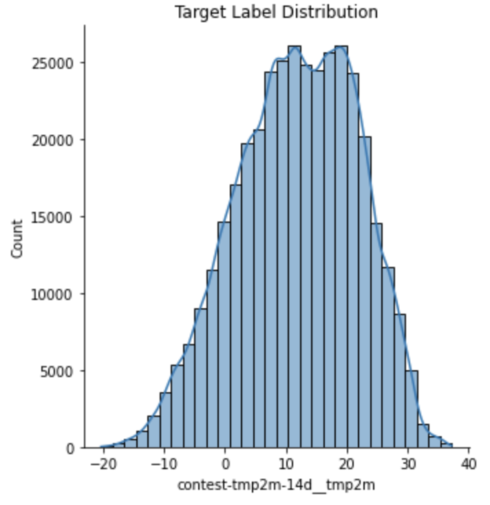
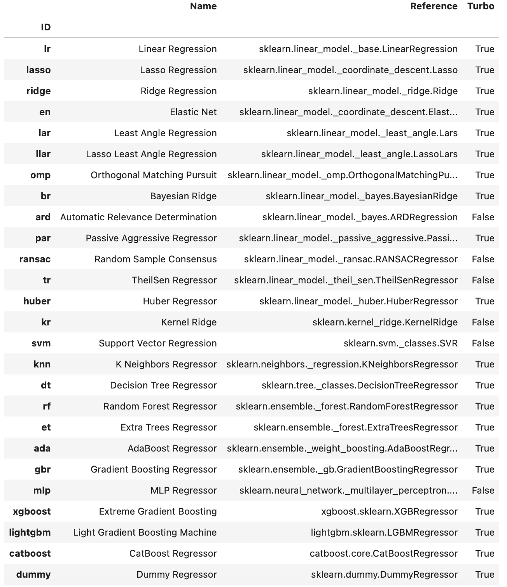

# WiDS---Datathon-2023
My approach and solution for the Datathon organized as part of the 6th Annual Women in Data Science (WiDS) Stanford Conference to be held on March 8, 2023

I took part in a two-day datathon organised by the Lawrence Livermore National Laboratory as part of the Stanford University's worldwide annual conference. 

The challenge focused on longer-term weather forecasting to help communities adapt to extreme weather events caused by climate change. The dataset was created in collaboration with [Climate Change AI (CCAI)](https://www.climatechange.ai). Participants will submit forecasts of temperature and precipitation for one year, competing against the other teams as well as official forecasts from NOAA.

## What does EDA reveal?

- The dataset has a total of 245 features. 
- **Target:** The arithmetic mean of the max and min observed temperature over the next 14 days for each location and start date, computed as ```(measured max temperature + measured mini temperature) / 2```
- The training dataset contains two years of data starting from September 1, 2014 to August 31, 2016 (731 days as 2016 is a leap year). The data is collected from a total of 514 different locations across the U.S. So the total number of samples available is 731 * 514 = 375734.
- The test dataset consists of the last two months November and December 2022 for the same locations. So the total number of samples available in the test dataset is 61 * 514 = 31354.

## Feature Selection

- Latitude and longitude data were grouped together for 514 different locations.
- 8 features contained nan values which were filled with the mean values.
- The feature climateregions was the only categorical feature and hence label encoded.
- From the dates available, three new features were added namely, year, month and day of year.
- Drop strongly correlated columns with two different thresholds of 0.9 and 0.95. A total of 65 features were dropped.
- The target distribution for the two years of training data is shown below.



## Approach to the problem

I used the [PyCaret](https://pycaret.gitbook.io/docs/) AutoML library for model comparisons and hyperparameter tuning. Here are the list of available models.


